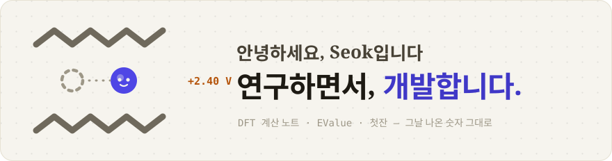
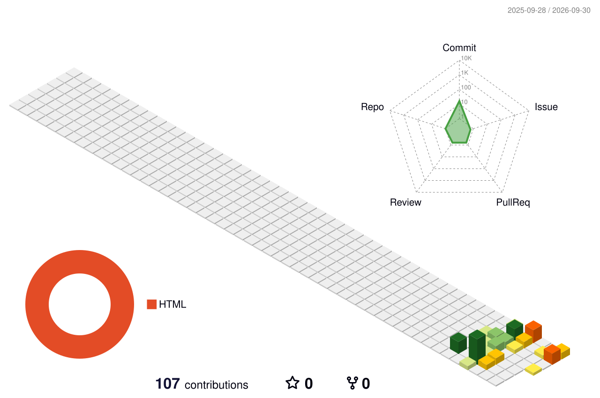
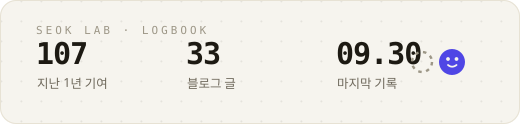
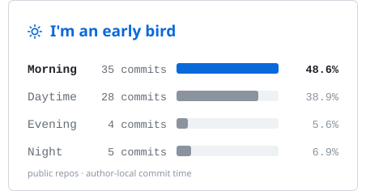
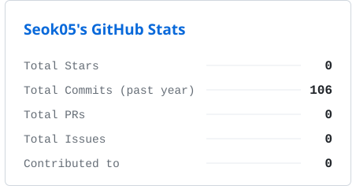

<picture>
  <source media="(prefers-color-scheme: dark)" srcset="assets/banner-dark.svg">
  
</picture>

  
  
  

낮에는 서비스를 만들고, 밤에는 배터리 재료를 원자 단위로 계산합니다.
계산이 어긋난 날도 배포가 꼬인 날도, 그날 나온 숫자 그대로 **[연구 노트](https://seok05.github.io)** 에 적어 둡니다.

### 🧪 지금 만들고 있는 것들

|  |  |  |
| :-: | --- | --- |
| 🔬 | **[DFT 연구 노트](https://seok05.github.io/?cat=dft)** | 배터리 재료 제일원리 계산을 바닥부터 · 이론 3편 + 실습 11편 |
| 🥃 | **[첫잔](https://seok05.github.io/?cat=cheotjan)** | 위스키 기록 앱을 만드는 바이브코딩 일지 · 11편 |
| 🔋 | **[EValue](https://seok05.github.io/?cat=evalue)** | 중고 전기차 매물을 매일 지켜보며 값을 견주는 도구 |
| 📄 | **[Paper](https://seok05.github.io/?cat=paper)** | 읽은 논문을 수치와 논증 구조까지 해부 |

### 🛠 도구 상자

**연구할 때** &nbsp;

**만들 때** &nbsp;

### ✏️ 최근에 쓴 글

<!-- BLOG:START -->
- **[DFT 실습 \[11\] — 계산기를 믿기 전에 시험부터: CHGNet과 G1 검증](https://seok05.github.io/posts/dft-practice-11.html)** 2026.09.30 · 연구 · DFT
- **[DFT 실습 \[10\] — Ni 하나가 전자를 가져가자, 구멍은 두 자리로 퍼졌다](https://seok05.github.io/posts/dft-practice-10.html)** 2026.09.30 · 연구 · DFT
- **[DFT 실습 \[9\] — 볼록 껍질이 세 번 뒤집히기까지: α-NaMnO₂ 전압 계산 총정리](https://seok05.github.io/posts/dft-practice-9.html)** 2026.09.28 · 연구 · DFT
- **[DFT 실습 \[8\] — 이웃을 세었더니 얀-텔러가 계단을 그렸다](https://seok05.github.io/posts/dft-practice-8.html)** 2026.09.28 · 연구 · DFT
- **[DFT 실습 \[7\] — 스핀을 뒤집자 두 구조가 정반대를 골랐다](https://seok05.github.io/posts/dft-practice-7.html)** 2026.09.27 · 연구 · DFT
<!-- BLOG:END -->

이 목록은 매일 아침 GitHub Actions가 [블로그 RSS](https://seok05.github.io/feed.xml)에서 가져다 둡니다.

### 🧊 잔디를 쌓으면

### 📊 기록 장부

<picture>
  <source media="(prefers-color-scheme: dark)" srcset="assets/stats-dark.svg">
  
</picture>

### 📌 책상 위 핀

<table>
  <tr>
    <td width="50%">
      <picture>
        <source media="(prefers-color-scheme: dark)" srcset="assets/pin-time-dark.svg">
        
      </picture>
    </td>
    <td width="50%">
      <picture>
        <source media="(prefers-color-scheme: dark)" srcset="assets/pin-stats-dark.svg">
        
      </picture>
    </td>
  </tr>
</table>

3D 잔디도, 이 카드들도 매일 아침 Actions가 직접 그립니다. 남의 서버 없이요.

---

배너의 파란 친구는 **나트륨 이온**입니다. 층상 NaMnO₂에서 Na 하나를 빼면 2.40 V가 나온다는 걸 배운 날부터 마스코트가 됐어요 → [그날의 기록](https://seok05.github.io/posts/dft-practice-6.html)
